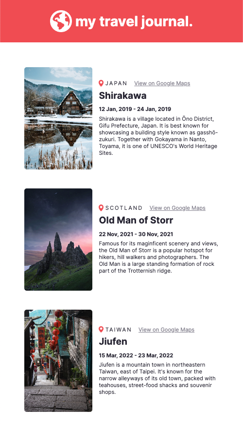

# Travel Journal

A solo project from the [Scrimba Frontend Developer Career Path](https://scrimba.com/learn/frontend)

## Table of Contents

- [Overview](#overview)
  - [Requirements](#requirements)
  - [Screenshots](#screenshots)
  - [Links](#links)
  - [Built with](#built-with)

## Overview

### Requirements

- [x] Data array in a separate .js file
    - [x] Title, location, Google Maps link, start date, end date, description, image URL

- [x] Use .map() and props
- [x] Styled & polished

### Screenshots

### Links

- Live Site URL: [GitHub Pages](https://xchristinawu.github.io/travel-journal/)

### Built with

- HTML, CSS, JavaScript, React
